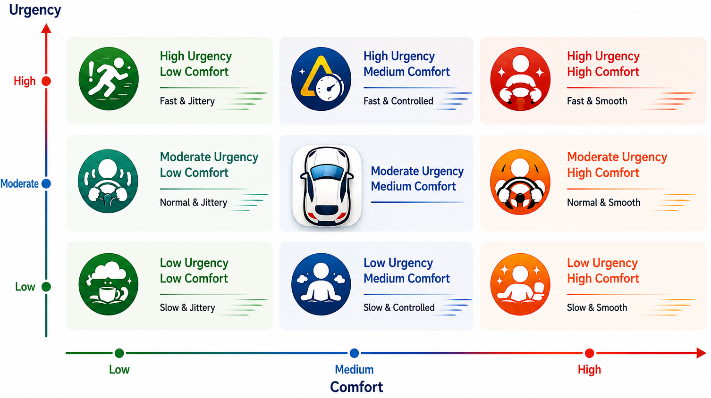
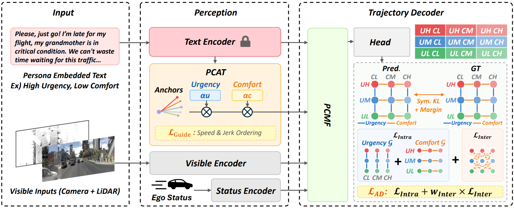
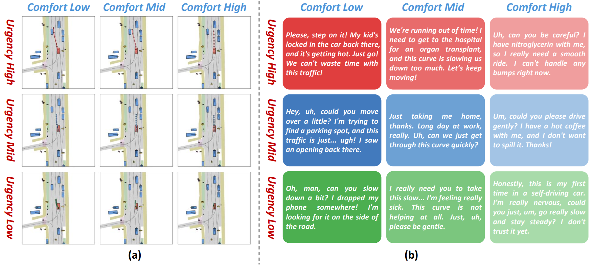
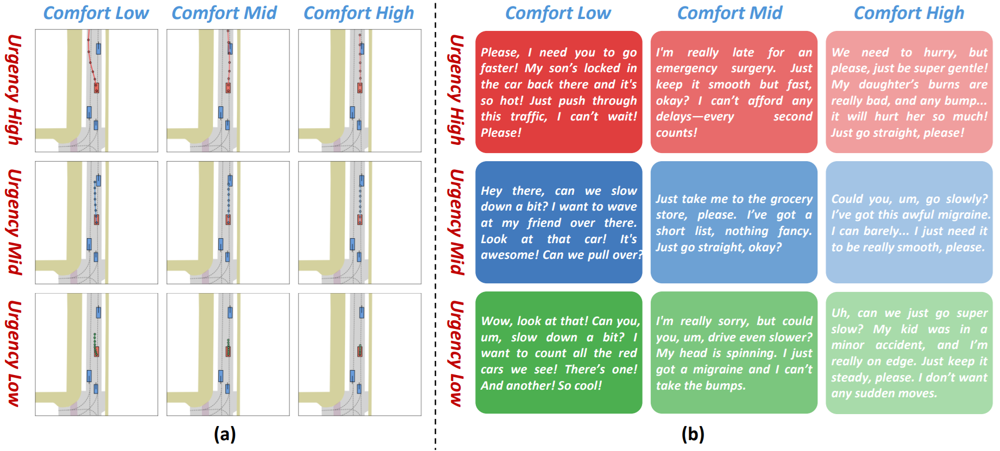
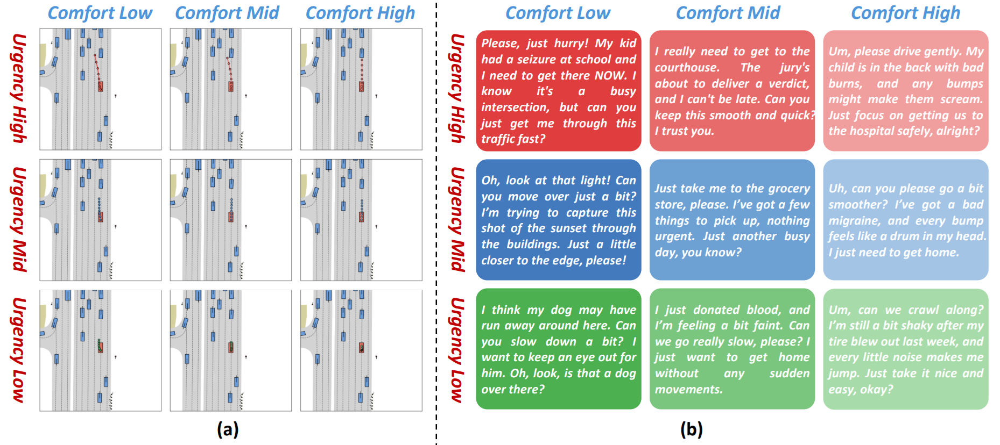

<div align="center">

<h1>PersonaDrive</h1>
<h3>Controllable Trajectory Prediction with Multi-Dimensional Driving Personas</h3>

<a href="https://scholar.google.com/citations?user=GxgmfkEAAAAJ&hl=en"><strong>Chan Lee</strong></a><sup>1</sup>
·
<a href="https://scholar.google.com/citations?hl=en&user=fcVfLCkAAAAJ"><strong>Kimin Yun</strong></a><sup>2</sup>
·
<a href="https://scholar.google.com/citations?hl=en&user=aQpHV-wAAAAJ"><strong>Yuseok Bae</strong></a><sup>2</sup>
·
<a href="https://scholar.google.com/citations?user=DEQbVOwAAAAJ&hl=en"><strong>Seong Tae Kim</strong></a><sup>1</sup>📧
·
<a href="https://scholar.google.co.kr/citations?user=JMZ80R8AAAAJ&hl=en"><strong>Jung Uk Kim</strong></a><sup>1</sup>📧

(📧) Corresponding authors, st.kim@khu.ac.kr and ju.kim@khu.ac.kr

<sup>1</sup>Kyung Hee University, Yong-in, South Korea, <sup>2</sup>ETRI, Daejeon, South Korea

Accepted to ECCV 2026!

<!-- []()&nbsp; -->
[](https://drive.google.com/file/d/1Aq_xFWfVGAi6W8m7NCnV6ZcWJzqWNPWz/view?usp=drive_link)&nbsp;
[](https://drive.google.com/file/d/1Aq_xFWfVGAi6W8m7NCnV6ZcWJzqWNPWz/view?usp=drive_link)
</div>

_________________ 

## Table of Contents
- [Abstract](#abstract)
- [Qualitative Results of PersonaDrive on PCT Dataset](#qualitative-results-of-personadrive-on-pct-dataset)
- [Getting Started](#getting-started)
- [Checkpoint](#checkpoint)
- [Results](#results)
- [Acknowledgement](#acknowledgement)
<!-- - [Citation](#citation) -->

## Abstract

Although recent trajectory prediction and end-to-end planning methods improve robustness in urban environments, they still lack meaningful controllability. Existing benchmarks either provide no persona-conditioned annotations or support only a single urgency spectrum (_i.e._, emergency, normal, relaxed), which cannot distinguish personas that share the same urgency level but require different driving dynamics. To address this, we propose (_i_) the Persona-Conditioned Trajectory (PCT) dataset, which decomposes driving personas along two axes—Temporal Urgency and Ride Comfort—and combines three levels of each to form a grid of nine personas, each paired with natural-language descriptions and trajectories, and (_ii_) PersonaDrive, a framework that can learn driving personas from language and can generate persona-specific trajectories. PersonaDrive incorporates Persona-Conditioned Anchor Transform (PCAT), which hierarchically reshapes anchors along both axes, and Persona-Conditioned Multi-Modal Fusion (PCMF) for BEV-level persona fusion. Training is supervised by a Hierarchical Guide Loss enforcing axis-aligned physical orderings and an Axis-Decomposed Diversity Loss preventing diagonal mode collapse. Experimental results show that PersonaDrive consistently improves over the compared baselines across all nine personas, with the largest gains in multi-dimensional scenarios where personas share one axis but differ along the other.

<div align=center>  </div>

## Qualitative Results of PersonaDrive on PCT Dataset
<div align=center>  </div>
<div align=center>  </div>
<div align=center>  </div>

## Getting Started
Follow the steps below to set up the environment and run the code.

1. [Getting started from NAVSIM environment preparation](https://github.com/autonomousvision/navsim?tab=readme-ov-file#getting-started-)
2. [Preparation of PersonaDrive environment](docs/setup_env.md)
3. [Preparation of PCT Dataset](docs/download_PCT_dataset.md)
4. [Training and Evaluation](docs/train_eval.md)

## Checkpoint & PCT Dataset Download

We release our best-performing and pre-trained baseline model checkpoint and PCT Dataset. 

You can download this checkpoint at [Checkpoint](https://drive.google.com/file/d/1Aq_xFWfVGAi6W8m7NCnV6ZcWJzqWNPWz/view?usp=drive_link) and PCT Dataset at [PCT Dataset](https://drive.google.com/file/d/1bRSiRy8CWpTWpo9abO_-L5RLjDRvSrhs/view?usp=drive_link).


## Results

| **Methods**              | **Avg. ADE⬇** | **Avg. FDE⬇** | **Avg. PDMS⬆** |
|--------------------------|---------------|---------------|----------------|
| LTF (TPAMI’22)           | 2.49          | 3.87          | 52.0           |
| Transfuser (TPAMI’22)    | 2.53          | 3.96          | 51.9           |
| UniAD (CVPR’23)          | 2.47          | 3.83          | 52.5           |
| Hydra-MDP (arXiv’24)     | 6.70          | 11.85         | 41.4           |
| PARA-Drive (CVPR’24)     | 4.84          | 9.00          | 51.9           |
| DiffusionDrive (CVPR’25) | 3.93          | 5.79          | 55.3           |
| VADv2 (ICLR’26)          | 6.18          | 10.76         | 47.9           | 
| **PersonaDrive (Ours)**  | **2.39**      | **3.71**      | **57.7**       | 

## Acknowledgement
Our codes benefits from the excellent [NAVSIM](https://github.com/autonomousvision/navsim), [Transfuser](https://github.com/autonomousvision/transfuser), [Diffusion Policy](https://github.com/real-stanford/diffusion_policy), [MapTR](https://github.com/hustvl/MapTR), [VAD](https://github.com/hustvl/VAD), [SparseDrive](https://github.com/swc-17/SparseDrive), [DiffusionDrive](https://github.com/hustvl/DiffusionDrive).


<!-- ## Citation
If you use PersonaDrive, please consider citing:

```bibtex

}
```
     -->